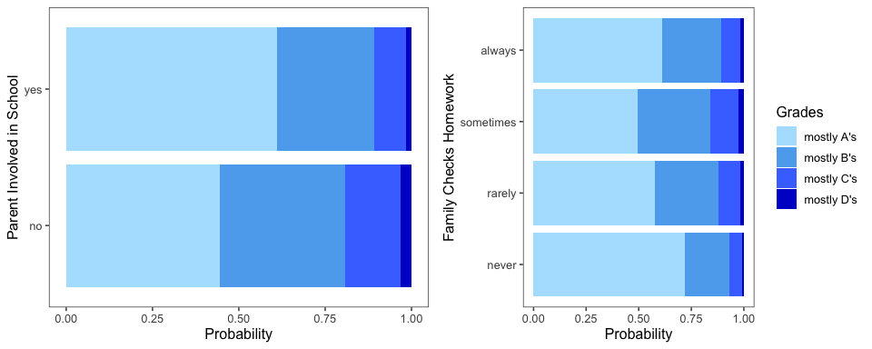

Analysis of National Household Education Surveys Program Data (NHES)
================

-   [Introduction](#introduction)
-   [Statistical Analysis](#statistical-analysis)
    -   [Correlations within the data](#correlations-within-the-data)
    -   [Cumulative Logistic Regression](#cumulative-logistic-regression)
    -   [Results of the Analysis/Odds Ratios](#results-of-the-analysisodds-ratios)
-   [Conclusion](#conclusion)
-   [Appendix](#appendix)

### Introduction

The aim of this analysis is to explore the associations between various U.S. household characteristics and family activities with a child’s grades in school (measured in A-D).

I used the National Household Education Surveys Program Data (NHES) for the analysis, specifically the Parent and Family Involvement in Education portion of the NHES. Most of the data is collected using self-administered questionnaires delivered and returned through the mail. I used the most recent available data at the time, which was collected in 2016, and contains responses from 14,075 collected surveys. The complete dataset can be found at <https://nces.ed.gov/nhes/dataproducts.asp#2016dp>.

While the survey collects over 100 variables, I chose to explore the following characteristics and their association with the grades a child recieves in school:

-household annual income
-how often the family helps child with homework (from never to 5+ times a week)
-how often the family checks to see if homework is done (from never to always)
-whether the family attended various cultural/art events or institutions in the past month (defined here as visiting a bookstore, library, concert or other show, museum or gallery\*)
-whether the parent is involved in the child's school in the current school year (defined here as volunteering, fundraising, attending PTA meetings or open houses, attending school plays, dances, sporting events or fairs\*)
-whether the household is single parent/guardian or not
-whether the household includes a stay-at-home parent or not

\*each of these components was a separate question in the original questionnaire, and has been combined into a composite variable for the purposes of this analysis

A more detailed description of the variables in the final version of the dataset can be found in the Appendix.

``` r
#import and prepare data
#import
library(dplyr)
library(tidyr)
setwd("/Users/Aleks/Desktop/biostats")
pfi_pu_pert<-read.csv("edu_data.csv",header = TRUE)

#change some variable names to make them more understandable in final model
colnames(pfi_pu_pert)<-c("P2EMPL","P1EMPL","single_parent","fssportx","fsvol",
                           "fsmtng","fsptmtng","fsfundrs","fscommte","family_checks_HW","income",
                           "family_helps_with_HW","folibrayx","fobookstx","foconcrtx","fomuseumx","grade")

#recoding some variables
#status for each parent: 5 is stay at home, 1 will be other status, -1 is missing value
pfi_pu_pert <- pfi_pu_pert %>% 
    mutate(P2EMPL = replace(P2EMPL, P2EMPL != 5 & P2EMPL != -1, 1))

pfi_pu_pert <- pfi_pu_pert %>% 
    mutate(P1EMPL = replace(P1EMPL, P1EMPL != 5, 1))

#creating one variable for stay at home parent (if either parent 1 or parent 2 is stay at home) 
pfi_pu_pert$stayhome_parent <- c(1)
pfi_pu_pert$stayhome_parent <- ifelse(pfi_pu_pert$P2EMPL== 5, 5, pfi_pu_pert$stayhome_parent) 
pfi_pu_pert$stayhome_parent <- ifelse(pfi_pu_pert$P1EMPL== 5, 5, pfi_pu_pert$stayhome_parent) 

#combine various NA entries for grades into one
pfi_pu_pert$grade[pfi_pu_pert$grade==-1] <- 5

#combine various types of parent involvement in school into one variable  
pfi_pu_pert$parent_involv_school <- c(2)
pfi_pu_pert$parent_involv_school <- ifelse(pfi_pu_pert$fssportx== 1, 1, pfi_pu_pert$parent_involv_school) 
pfi_pu_pert$parent_involv_school <- ifelse(pfi_pu_pert$fsvol== 1, 1, pfi_pu_pert$parent_involv_school) 
pfi_pu_pert$parent_involv_school <- ifelse(pfi_pu_pert$fsptmtng== 1, 1, pfi_pu_pert$parent_involv_school) 
pfi_pu_pert$parent_involv_school <- ifelse(pfi_pu_pert$fsfundrs== 1, 1, pfi_pu_pert$parent_involv_school) 
pfi_pu_pert$parent_involv_school <- ifelse(pfi_pu_pert$fsmtng== 1, 1, pfi_pu_pert$parent_involv_school) 
pfi_pu_pert$parent_involv_school <- ifelse(pfi_pu_pert$fscommte== 1, 1, pfi_pu_pert$parent_involv_school) 

#combine various variables representing culture/art event attendance into one variable  
pfi_pu_pert$art_event_attendance <- c(2)
pfi_pu_pert$art_event_attendance <- ifelse(pfi_pu_pert$folibrayx== 1, 1, pfi_pu_pert$art_event_attendance) 
pfi_pu_pert$art_event_attendance <- ifelse(pfi_pu_pert$fobookstx== 1, 1, pfi_pu_pert$art_event_attendance) 
pfi_pu_pert$art_event_attendance <- ifelse(pfi_pu_pert$foconcrtx== 1, 1, pfi_pu_pert$art_event_attendance) 
pfi_pu_pert$art_event_attendance <- ifelse(pfi_pu_pert$fomuseumx== 1, 1, pfi_pu_pert$art_event_attendance) 

#changing numericalvecctors to factors
pfi_pu_pert <- pfi_pu_pert %>% mutate_if(is.integer,as.factor)
pfi_pu_pert <- pfi_pu_pert %>% mutate_if(is.numeric,as.factor)

#changing variable coding to more understandable entries for model 
pfi_pu_pert <- pfi_pu_pert %>% mutate(single_parent = recode(single_parent, '1' = "no", '2' = "yes"),
                                      parent_involv_school = recode(parent_involv_school, '1' = "yes", '2' = "no"),
                                      art_event_attendance = recode(art_event_attendance, '1' = "yes", '2' = "no"),
                                      family_checks_HW = recode(family_checks_HW, '1' = "never", '2' = "rarely",
                                                                '3' = "sometimes", '4' = "always",'-1' = "missing"),
                                      income = recode(income, '1' = "under10K", '2' = "10-20K",'3' = "20-30K",
                                                      '4' = "30-40K", '5' = "40-50K", '6' = "50-60K", '7' = "60-75K",
                                                      '8' = "75-100K", '9' = "100-150K", '10' = "over150K"),
                                      family_helps_with_HW = recode(family_helps_with_HW, '1' = "<1/week", 
                                                                    '2' = "1-2/week", '3' = "3-4/week", '4' = ">=5/week",
                                                                    '5'= "never", '-1' = "missing"),
                                      stayhome_parent = recode(stayhome_parent, '1' = "no", '5' = "yes"),
                                      grade = recode(grade, '1' = "A", '2' = "B", '3' = "C", '4' = "D", '5' = "missing")
                                      )
```

Below is the distribution of income in the dataset. The majority of repondents are in the higher income brackets:

``` r
library(ggplot2)
library(ggthemes)
#income distribution
library(ggplot2)
ggplot(data = pfi_pu_pert, aes(x = income)) +
    geom_bar(fill="blue", color="blue", alpha=0.5) + ylab("Number of Households") +xlab("Income Level")  + scale_x_discrete(labels=c("1,000-10,000","10,001-20,000","20,001-30,000","30,001-40,000","40,001-50,000","50,001-60,000", "60,001-75,000","75,001-100,000","100,001-150,000","150,000+"))  + theme_few() + coord_flip()
```


A large percentage of households report their children receiving mostly A and B grades in school. Because this variable is self-reported, there is the danger that many families are, even unknowingly, reporting higher grades than were actually assigned. This might especially be an issue since households are asked to report not GPA's but rather a sense that their children are receiving for instance 'mostly B's':

``` r
#data visualization
#bar plots
#grade distribution
ggplot(data = pfi_pu_pert, aes(x = grade)) +
    geom_bar(fill="blue", color="blue", alpha=0.5) + scale_x_discrete(labels=c("Other*","mostly D's","mostly C's","mostly B's","mostly A's"),limits = rev(levels(pfi_pu_pert$grade))) + theme_few() + labs(caption = "*Data missing or school does not assign these grades", x = "Grades", y = "Number of Students") + coord_flip()
```


Below are the proportions of survey respondents reporting a stay at home parent or a single parent/guardian household:

``` r
#waffle charts
#kids with stay at home parents
library(waffle)
library(extrafont)
staywaffle <- count(pfi_pu_pert, stayhome_parent)
staywaffle <- c('yes' = 2328,'no' = 11747)
waffle(staywaffle/139, rows = 10, title='Stay at home parent',colors = c("light blue", "blue"))
```


``` r
#kids in single parent household
singlewaffle <- count(pfi_pu_pert,single_parent)
singlewaffle <- c('no' = 10432, 'yes' = 3643)
waffle(singlewaffle/140, rows = 10, title='Single Parent', colors = c("light blue", "blue"))
```


Here we can see the distribution of grades by income. Higher incomes appear to be strongly associated with children being assigned higher grades. Almost no surveyed families in higher income brackets report that their children are assigned D's:

``` r
#grades by income
library(dplyr)
library(ggplot2)
library(ggthemes)
grade_income <- pfi_pu_pert  %>%
group_by(income) %>% count(grade)  %>% filter(grade!="missing")
ggplot(data = grade_income, aes(x = income, y=n, fill = forcats::fct_rev(grade))) +
    geom_col(position="fill")  + scale_x_discrete(labels=c("1,000-10,000","10,001-20,000","20,001-30,000","30,001-40,000","40,001-50,000","50,001-60,000", "60,001-75,000","75,001-100,000","100,001-150,000","150,000+")) + labs(y="", x="Income Level", fill="Grades") +  
    scale_fill_manual(values = c("mediumblue","royalblue1","steelblue2","lightskyblue1"),labels = c("mostly D's", "mostly C's", "mostly B's", "mostly A's")) + theme_few() + coord_flip() + guides(fill = guide_legend(reverse = TRUE))
```


Single parent status seems to be closely linked with income, which makes sense as the earning potential of a one-person household is smaller:

``` r
#grades by income
library(dplyr)
library(ggplot2)
library(ggthemes)
single_income <- pfi_pu_pert  %>%
group_by(income) %>% count(single_parent) 
ggplot(data = single_income, aes(x = income, y=n, fill=single_parent)) +
    geom_col(position = "fill") + scale_x_discrete(labels=c("1,000-10,000","10,001-20,000","20,001-30,000","30,001-40,000","40,001-50,000","50,001-60,000", "60,001-75,000","75,001-100,000","100,001-150,000","150,000+")) + labs(y="", x="Income Level", fill="Single Parent Household") +  coord_flip() +
    scale_fill_manual(values = c("lightskyblue1", "steelblue2", "royalblue1", "mediumblue"),labels = c("no", "yes")) + theme_few() 
```


``` r
#remove unwanted values pre-analysis (surveys reporting non-letter grades, missing values) (usually coded as -1 in dataset)
#use this dataset for regression model
pfi_pu_pert_m <- pfi_pu_pert
pfi_pu_pert_m <- pfi_pu_pert_m[pfi_pu_pert_m$grade!="missing",]
pfi_pu_pert_m <- pfi_pu_pert_m[pfi_pu_pert_m$family_helps_with_HW!="missing",]
pfi_pu_pert_m <- pfi_pu_pert_m[pfi_pu_pert_m$family_checks_HW!="missing",]
```

### Statistical Analysis

#### Correlations within the data

A chi squared test was used to test whether or not there is a significant association between certain variables. Income level was associated with parent participation in school and families attending cultural/art events. Income was also associated with single parent household status, since one parent households may often have just one income.

``` r
#chisq test of independence to check significance of association
inc_cult_chi <- chisq.test(pfi_pu_pert_m$income,pfi_pu_pert_m$art_event_attendance)
inc_involv_chi <- chisq.test(pfi_pu_pert_m$income,pfi_pu_pert_m$parent_involv_school)
inc_single_chi <- chisq.test(pfi_pu_pert_m$income,pfi_pu_pert_m$single_parent)

cat("Chi-square test p-value for Income and Attending Cultural Activities:",inc_cult_chi$p.value,"\n")
```

    ## Chi-square test p-value for Income and Attending Cultural Activities: 1.820021e-13

``` r
cat("Chi-square test p-value for Income and Parental Involvement in Schools:",inc_involv_chi$p.value,"\n")
```

    ## Chi-square test p-value for Income and Parental Involvement in Schools: 3.452529e-47

``` r
cat("Chi-square test p-value for Income and Single Parent Status:",inc_single_chi$p.value,"\n")
```

    ## Chi-square test p-value for Income and Single Parent Status: 0

The Cramers V test (code available at <https://www.r-bloggers.com/example-8-39-calculating-cramers-v/>) was used to try to check how strong these existing associations are. The strongest association occurs between income and single parent status, which is not unexpected. The Cramers V value is 0.4, (values for Cramers V range from 0 to 1, with values close to 0 indicating a low association and close to 1 indicating a very high association). Because this value is not extremely high, I will keep both variables in the model.

``` r
#cramers v to check strength of association
cv.test <- function(x,y) {
  CV <- sqrt(chisq.test(x, y, correct=FALSE)$statistic /
    (length(x) * (min(length(unique(x)),length(unique(y))) - 1)))
  return(as.numeric(CV))
}

cv_inc_cult <- cv.test(pfi_pu_pert_m$income,pfi_pu_pert_m$art_event_attendance)
cat("Cramer's V for Income and Attending Cultural/Art Activities:",cv_inc_cult,"\n")
```

    ## Cramer's V for Income and Attending Cultural/Art Activities: 0.08384082

``` r
cv_inc_involv <- cv.test(pfi_pu_pert_m$income,pfi_pu_pert_m$parent_involv_school)
cat("Cramer's V for Income and Parental Involvement in Schools:",cv_inc_involv,"\n")
```

    ## Cramer's V for Income and Parental Involvement in Schools: 0.1462707

``` r
cv_inc_single <- cv.test(pfi_pu_pert_m$income,pfi_pu_pert_m$single_parent)
cat("Cramer's V for Income and Single Parent Status:",cv_inc_single,"\n")
```

    ## Cramer's V for Income and Single Parent Status: 0.4126172

#### Cumulative Logistic Regression

``` r
#setting reference levels for regression
pfi_pu_pert_m$grade <- factor(pfi_pu_pert_m$grade, ordered=TRUE, levels = c("A","B","C","D"))
pfi_pu_pert_m$stayhome_parent <- relevel(pfi_pu_pert_m$stayhome_parent, ref="yes")
pfi_pu_pert_m$single_parent <- relevel(pfi_pu_pert_m$single_parent, ref="yes")
pfi_pu_pert_m$parent_involv_school <- relevel(pfi_pu_pert_m$parent_involv_school, ref="no")
pfi_pu_pert_m$art_event_attendance <- relevel(pfi_pu_pert_m$art_event_attendance, ref="no")
pfi_pu_pert_m$family_checks_HW <- factor(pfi_pu_pert_m$family_checks_HW, ordered=FALSE, levels = c("always","never","rarely","sometimes"))
pfi_pu_pert_m$family_checks_HW <- relevel(pfi_pu_pert_m$family_checks_HW, ref="always")
pfi_pu_pert_m$family_helps_with_HW <- factor(pfi_pu_pert_m$family_helps_with_HW, ordered=FALSE, levels = c(">=5/week","<1/week","1-2/week","3-4/week","never"))
pfi_pu_pert_m$family_helps_with_HW <- relevel(pfi_pu_pert_m$family_helps_with_HW, ref=">=5/week")
```

I applied a cumulative logistic regression model to the data. Unfortunately, according to the test provided in the package VGAM, the proportional odds assumption was not met.

``` r
library(VGAM)
nonparallel <- vglm(grade ~ single_parent + parent_involv_school + art_event_attendance + family_checks_HW + income + family_helps_with_HW + stayhome_parent, data = pfi_pu_pert_m,
                                       family = cumulative(link = "logit", parallel = FALSE, reverse = TRUE))
parallel <- vglm(grade ~ single_parent + parent_involv_school + art_event_attendance + family_checks_HW + income + family_helps_with_HW + stayhome_parent, data = pfi_pu_pert_m,
                                    family = cumulative(link = "logit", parallel = TRUE, reverse = TRUE))
lrtest(nonparallel,parallel)
```

    ## Likelihood ratio test
    ## 
    ## Model 1: grade ~ single_parent + parent_involv_school + art_event_attendance + 
    ##     family_checks_HW + income + family_helps_with_HW + stayhome_parent
    ## Model 2: grade ~ single_parent + parent_involv_school + art_event_attendance + 
    ##     family_checks_HW + income + family_helps_with_HW + stayhome_parent
    ##     #Df LogLik Df  Chisq Pr(>Chisq)   
    ## 1 33969 -11110                        
    ## 2 34009 -11145 40 70.843   0.001893 **
    ## ---
    ## Signif. codes:  0 '***' 0.001 '**' 0.01 '*' 0.05 '.' 0.1 ' ' 1

Since the test is supposed to be anti-conservative, I have also provided a visual for each separate variable (very helpful code and explanation here: <https://stats.idre.ucla.edu/r/dae/ordinal-logistic-regression/>)

It seems that the issue lies mainly with the variable for income.

``` r
library(MASS)
#need numerical outcome for check
pfi_pu_pert_m <- pfi_pu_pert_m %>% mutate(grade = recode(grade, "A" = "1", "B" = "2", "C" = "3", "D" = "4"))
m <- polr(grade ~ single_parent + parent_involv_school + art_event_attendance + family_checks_HW + income + family_helps_with_HW + stayhome_parent, data = pfi_pu_pert_m, Hess = TRUE)
## store table
ctable <- coef(summary(m))
## calculate and store p values
p <- pnorm(abs(ctable[, "t value"]), lower.tail = FALSE) * 2

## combined table
ctable <- cbind(ctable, "p value" = p)
#exp(cbind(OR = coef(m), confint.default(m)))

#proportional odds assumption check
library(Hmisc)
sf <- function(y) {
  c('Y>=1' = qlogis(mean(y >= 1)),
    'Y>=2' = qlogis(mean(y >= 2)),
    'Y>=3' = qlogis(mean(y >= 3)))
}

s <- with(pfi_pu_pert_m, summary(as.numeric(grade) ~ single_parent + parent_involv_school + art_event_attendance + family_checks_HW + income + family_helps_with_HW + stayhome_parent, fun=sf))

s[, 4] <- s[, 4] - s[, 3]
s[, 3] <- s[, 3] - s[, 3]
plot(s, which=1:3, pch=1:3, xlab='logit', main=' ', xlim=range(s[,3:4]))
```


``` r
#return grades to factor with letters
pfi_pu_pert_m <- pfi_pu_pert_m %>% mutate(grade = recode(grade, '1' = "A", '2' = "B", '3' = "C", '4' = "D", '5' = "missing"))
```

One alternative is to use a multinomial logistic model, or perhaps collapse the dependent variable (A's and B's vs C's and D's) and apply binary logistic regression. However, the VGAM package also allows for a partial proportinal odds model, where variables that do not meet the proportional odds assumption can be indicated as such. I therefore used the partial proportional odds model as my final model, indicating income level as not meeting the proportional odds assumption. The final model run in R is below.

``` r
#test which partial proportional odds model is better
#partialp_all <- vglm(grade ~ single_parent + parent_involv_school + art_event_attendance + family_checks_HW + income + family_helps_with_HW + stayhome_parent, data = pfi_pu_pert_m,
                #family = cumulative(link = "logit", parallel = FALSE~ income + family_helps_with_HW + family_checks_HW, reverse = TRUE))
#summary(partialp_all)

#partialp_inc <- vglm(grade ~ single_parent + parent_involv_school + art_event_attendance + family_checks_HW + income + family_helps_with_HW + stayhome_parent, data = pfi_pu_pert_m,
                #family = cumulative(link = "logit", parallel = FALSE~ income, reverse = TRUE))
#summary(partialp_inc)
#lrtest(partialp_inc,partialp_all)
```

``` r
partialp_inc <- vglm(grade ~ single_parent + parent_involv_school + art_event_attendance + family_checks_HW + income + family_helps_with_HW + stayhome_parent, data = pfi_pu_pert_m,
                family = cumulative(link = "logit", parallel = FALSE~ income, reverse = FALSE))
```

Below is a table with the estimated model coefficients as well as exponentiated coefficients (odds ratios). Intercept 1 is for odds of earning A's vs B's, C's and D's.
Intercept 2 is for odds of earning A's and B's vs C's and D's.
Intercept 3 is for odds of earning A's and B's and C's vs D's.

``` r
#extract coefficients from model and present in a table
model_table <- summaryvglm(partialp_inc)
P_values <- dplyr::select(as.data.frame(model_table@coef3), c("Estimate","Pr(>|z|)")) 
P_values <- mutate(P_values, Odds_Ratio = exp(Estimate))
P_values <- bind_cols(as.data.frame(rownames(model_table@coef3)),P_values)
P_values$significance <- c("&#42;")
P_values$significance <- ifelse(P_values$`Pr(>|z|)` > 0.05, "",P_values$significance)
colnames(P_values) <- c("Model Parameter","Estimate","P_value","Odds Ratio","Significance")
P_values <- P_values[c("Model Parameter","Estimate","Odds Ratio","P_value","Significance")]
#display exponentiated coefficients and pvalues
#P_values
library(knitr)
kable(P_values)
```

| Model Parameter                   |    Estimate|  Odds Ratio|   P\_value| Significance |
|:----------------------------------|-----------:|-----------:|----------:|:-------------|
| (Intercept):1                     |  -1.8650247|   0.1548924|  0.0000000| \*           |
| (Intercept):2                     |   0.0279738|   1.0283688|  0.8423046|              |
| (Intercept):3                     |   1.8894087|   6.6154561|  0.0000000| \*           |
| single\_parentno                  |   0.2021130|   1.2239864|  0.0000098| \*           |
| parent\_involv\_schoolyes         |   0.6680950|   1.9505180|  0.0000000| \*           |
| art\_event\_attendanceyes         |   0.5013391|   1.6509306|  0.0000000| \*           |
| family\_checks\_HWnever           |   0.4948657|   1.6402780|  0.0000015| \*           |
| family\_checks\_HWrarely          |  -0.1445409|   0.8654196|  0.0417536| \*           |
| family\_checks\_HWsometimes       |  -0.4601868|   0.6311657|  0.0000000| \*           |
| income10-20K:1                    |   0.2694610|   1.3092586|  0.0305238| \*           |
| income10-20K:2                    |   0.2106136|   1.2344353|  0.1117887|              |
| income10-20K:3                    |   0.2454685|   1.2782200|  0.3376198|              |
| income20-30K:1                    |   0.3472524|   1.4151738|  0.0036832| \*           |
| income20-30K:2                    |   0.3547370|   1.4258057|  0.0064380| \*           |
| income20-30K:3                    |   0.1059756|   1.1117947|  0.6612234|              |
| income30-40K:1                    |   0.4591517|   1.5827307|  0.0001164| \*           |
| income30-40K:2                    |   0.3730853|   1.4522082|  0.0041702| \*           |
| income30-40K:3                    |   0.3488730|   1.4174691|  0.1668634|              |
| income40-50K:1                    |   0.4188250|   1.5201743|  0.0006505| \*           |
| income40-50K:2                    |   0.4663943|   1.5942354|  0.0007101| \*           |
| income40-50K:3                    |   0.9129936|   2.4917707|  0.0030215| \*           |
| income50-60K:1                    |   0.6623186|   1.9392836|  0.0000001| \*           |
| income50-60K:2                    |   0.4339959|   1.5434126|  0.0017382| \*           |
| income50-60K:3                    |   0.5418764|   1.7192297|  0.0547913|              |
| income60-75K:1                    |   0.8179322|   2.2658099|  0.0000000| \*           |
| income60-75K:2                    |   0.7738076|   2.1680055|  0.0000000| \*           |
| income60-75K:3                    |   0.8287190|   2.2903828|  0.0038130| \*           |
| income75-100K:1                   |   0.9495752|   2.5846116|  0.0000000| \*           |
| income75-100K:2                   |   0.8715978|   2.3907276|  0.0000000| \*           |
| income75-100K:3                   |   0.9869052|   2.6829186|  0.0001607| \*           |
| income100-150K:1                  |   1.1107175|   3.0365362|  0.0000000| \*           |
| income100-150K:2                  |   1.2667298|   3.5492269|  0.0000000| \*           |
| income100-150K:3                  |   1.9643001|   7.1299203|  0.0000000| \*           |
| incomeover150K:1                  |   1.3979764|   4.0470022|  0.0000000| \*           |
| incomeover150K:2                  |   1.7957085|   6.0237409|  0.0000000| \*           |
| incomeover150K:3                  |   2.2038628|   9.0599429|  0.0000000| \*           |
| family\_helps\_with\_HW&lt;1/week |   0.4924671|   1.6363482|  0.0000000| \*           |
| family\_helps\_with\_HW1-2/week   |   0.2881690|   1.3339827|  0.0000152| \*           |
| family\_helps\_with\_HW3-4/week   |   0.2131367|   1.2375538|  0.0016960| \*           |
| family\_helps\_with\_HWnever      |   0.5133792|   1.6709281|  0.0000000| \*           |
| stayhome\_parentno                |  -0.2137523|   0.8075484|  0.0000900| \*           |

Here is the confusion matrix for how well the model classified households. Because of the large amount of A's and B's in the dataset, the model assigns high probabilities to occurance of A's and B's. No observations were classified as a D.

``` r
#get predictions
library(VGAM)
predicted_prob <- predictvglm(partialp_inc, newdata = pfi_pu_pert_m,
            type = c("response"))
predicted_grades <- colnames(predicted_prob)[apply(predicted_prob,1,which.max)]
## Confusion matrix and misclassification error
table(pfi_pu_pert_m$grade, predicted_grades) 
```

    ##    predicted_grades
    ##        A    B    C
    ##   A 5070  878    2
    ##   B 2743 1111    7
    ##   C  743  522    7
    ##   D  114  145    2

Residual deviance and -2\*Log Likelihood was higher for the intercept-only model.

``` r
intercept_only <- vglm(grade ~ 1, data = pfi_pu_pert_m,
                family = cumulative(link = "logit", parallel = FALSE~ income, reverse = FALSE))
```

``` r
lrtest_vglm(intercept_only,partialp_inc)
```

    ## Likelihood ratio test
    ## 
    ## Model 1: grade ~ 1
    ## Model 2: grade ~ single_parent + parent_involv_school + art_event_attendance + 
    ##     family_checks_HW + income + family_helps_with_HW + stayhome_parent
    ##     #Df LogLik  Df  Chisq Pr(>Chisq)    
    ## 1 34029 -11768                          
    ## 2 33991 -11121 -38 1294.4  < 2.2e-16 ***
    ## ---
    ## Signif. codes:  0 '***' 0.001 '**' 0.01 '*' 0.05 '.' 0.1 ' ' 1

#### Results of the Analysis/Odds Ratios

In general, the odds of a student receiving mostly A's and B's instead of C's and D's increase for families with higher income, two parent households, families with a stay at home parent, families that are involved in their child's school, and families that attended culture/art events.

Odds of receiving high grades decrease the more often families help with homework.

No distinct pattern emerged for the relationship between grades and frequency of the family checking to see if homework was done.

For instance:

-Odds of a student receiving A's or B's instead of C's or D's are 23% higher for two parent households.
-Odds of a student receiving A's or B's instead of C's or D's are almost twice as high for families with parents involved in their child's school.
-Odds of a student receiving A's or B's instead of C's or D's are 65% higher for families that attended cultural/art events or institutions.
-Odds of a student receiving A's or B's instead of C's or D's are 20% lower for households without a stay at home parent.
-Odds of a student receiving A's or B's instead of C's or D's are 67% higher for families that never help a child with their homework compared to those that always help.
-Odds of a student receiving A's or B's instead of C's or D's are 6 times higher for the highest income group compared to the lowest income group.

### Conclusion

Odds ratios can be difficult to understand because they are not intuitive, so I will also use probabilities to give an idea of the estimated relationships found by the model.

In general, the probability of a student receiving mostly A's and B's instead of C's and D's increases for families with higher income, two parent households, families with a stay at home parent, families that are involved in their child's school, and families that attend cultural/art events or institutions. The strongest effect is between income and grades.

Probability of receiving high grades decreases the more often families help with homework.

No distinct pattern emerged for the relationship between grades and frequency of the family checking to see if homework was done.

I have plotted the probability of receiving various grades below, highlighting some of the most important associations between grades and family characteristics. The estimated probabilities will change for families with different characteristics (for families in a different income bracket, for instance), though the general direction of the associations will remain the same. The plots below show probabilities of a child earning mostly A's, B's, C's or D's for a household most commonly found in the U.S. This is for a family:

-earning 50,000-60,000 annually
-with two parents/guardians living at home
-with no stay at home parent
-that has attended a cultural/art event within the past month
-that participated in the child's school within the past month
-that usually checks if the child's homework is done every day
-that helps the child with homework assignments less than once a week

I will change one of these variables at a time to see how the model found each characteristic to be associated with the child's grades in school.

``` r
#get predictions
predictions <- predict(partialp_inc, newdata = pfi_pu_pert_m, 
             type = c("response"))
pred_df <- cbind(pfi_pu_pert_m,predictions)
#subset of dataframe selecting variables used in final model
pred_df <- pred_df[,c(3,10,11,12,18,19:24)]

#stacking rows by grade
pred_df1 <- pred_df[,c(1:8)]
pred_df1$grade <- c('A')
colnames(pred_df1) <- c("single_parent" , "family_checks_HW","income","family_helps_with_HW","stayhome_parent","parent_involv_school","art_event_attendance","probability","grade")
pred_df2 <- pred_df[,c(1:7,9)]
pred_df2$grade <- c('B')
colnames(pred_df2) <- c("single_parent" , "family_checks_HW","income","family_helps_with_HW","stayhome_parent","parent_involv_school","art_event_attendance","probability","grade")
pred_df3 <- pred_df[,c(1:7,10)]
pred_df3$grade <- c('C')
colnames(pred_df3) <- c("single_parent" , "family_checks_HW","income","family_helps_with_HW","stayhome_parent","parent_involv_school","art_event_attendance","probability","grade")
pred_df4 <- pred_df[,c(1:7,11)]
pred_df4$grade <- c('D')
colnames(pred_df4) <- c("single_parent" , "family_checks_HW","income","family_helps_with_HW","stayhome_parent","parent_involv_school","art_event_attendance","probability","grade")

pred_df <- bind_rows(pred_df1,pred_df2,pred_df3,pred_df4)
pred_df$grade <- ordered(pred_df$grade, levels=c("A","B","C","D"))

#creating dataframe to show probabilities for income brackets
grade_income <- pred_df[pred_df$single_parent=="no" & pred_df$art_event_attendance=="yes" & pred_df$parent_involv_school=="yes" & pred_df$family_checks_HW=="always" & pred_df$family_helps_with_HW=="<1/week" & pred_df$stayhome_parent=="no",]
grade_income <- distinct(grade_income)
plot_inc <- ggplot(data = grade_income, aes(y = probability, x=income, fill=grade)) +
    geom_col(position = position_stack(reverse = TRUE)) + scale_x_discrete(labels=c("1,000-10,000","10,001-20,000","20,001-30,000","30,001-40,000","40,001-50,000","50,001-60,000", "60,001-75,000","75,001-100,000","100,001-150,000","150,000+")) + labs(y="Probability", x="Income in USD", fill="Grades") +  
    scale_fill_manual(values = c("lightskyblue1", "steelblue2", "royalblue1", "mediumblue"),labels = c("mostly A's", "mostly B's", "mostly C's", "mostly D's")) + 
    theme(axis.text.x = element_text(size = 7, angle = 330, hjust = 0)) + theme_few() + coord_flip()

#creating dataframe to show probabilities for single parent status
grade_single <- pred_df[pred_df$income=="50-60K" & pred_df$art_event_attendance=="yes" & pred_df$parent_involv_school=="yes" & pred_df$family_checks_HW=="always" & pred_df$family_helps_with_HW=="<1/week" & pred_df$stayhome_parent=="no",]
grade_single <- distinct(grade_single)
plot_single <- ggplot(data = grade_single, aes(y = probability, x=single_parent, fill=grade)) +
    geom_col(position = position_stack(reverse = TRUE),show.legend = FALSE) + scale_x_discrete(labels=c("single parent","two parent")) + labs(y="Probability", x="Single Parent Status", fill="Grades") +  
    scale_fill_manual(values = c("lightskyblue1", "steelblue2", "royalblue1", "mediumblue"),labels = c("mostly A's", "mostly B's", "mostly C's", "mostly D's")) + theme_few() + coord_flip()

#creating dataframe to show probabilities for cultural activity
grade_cult <- pred_df[pred_df$income=="50-60K" & pred_df$parent_involv_school=="yes" & pred_df$family_checks_HW=="always" & pred_df$family_helps_with_HW=="<1/week" & pred_df$stayhome_parent=="no" & pred_df$single_parent=="no",]
grade_cult <- distinct(grade_cult)
plot_cult <- ggplot(data = grade_cult, aes(y = probability, x=art_event_attendance, fill=grade)) +
    geom_col(position = position_stack(reverse = TRUE)) + scale_x_discrete(labels=c("no","yes")) + labs(y="Probability", x="Attended culture/art events", fill="Grades") +  
    scale_fill_manual(values = c("lightskyblue1", "steelblue2", "royalblue1", "mediumblue"),labels = c("mostly A's", "mostly B's", "mostly C's", "mostly D's")) + theme_few() + coord_flip()

#creating dataframe to show probabilities for parental involvement in school
grade_parschool <- pred_df[pred_df$income=="50-60K" & pred_df$art_event_attendance=="yes" & pred_df$family_checks_HW=="always" & pred_df$family_helps_with_HW=="<1/week" & pred_df$stayhome_parent=="no" & pred_df$single_parent=="no",]
grade_parschool <- distinct(grade_parschool)
plot_involv <- ggplot(data = grade_parschool, aes(y = probability, x=parent_involv_school, fill=grade)) +
    geom_col(position = position_stack(reverse = TRUE),show.legend = FALSE) + scale_x_discrete(labels=c("no","yes")) + labs(y="Probability", x="Parent Involved in School", fill="Grades") +  
    scale_fill_manual(values = c("lightskyblue1", "steelblue2", "royalblue1", "mediumblue"),labels = c("mostly A's", "mostly B's", "mostly C's", "mostly D's")) + theme_few() + coord_flip()

#creating dataframe to show probabilities for checking homework
grade_hwcheck <- pred_df[pred_df$income=="50-60K" & pred_df$art_event_attendance=="yes" & pred_df$family_helps_with_HW=="<1/week" & pred_df$stayhome_parent=="no" & pred_df$single_parent=="no" & pred_df$parent_involv_school=="yes",]
grade_hwcheck <- distinct(grade_hwcheck)
grade_hwcheck$family_checks_HW <- ordered(grade_hwcheck$family_checks_HW, levels=c("never","rarely","sometimes","always"))
plot_checkhw <- ggplot(data = grade_hwcheck, aes(y = probability, x=family_checks_HW, fill=grade)) +
    geom_col(position = position_stack(reverse = TRUE)) + scale_x_discrete(labels=c("never","rarely","sometimes","always")) + labs(y="Probability", x="Family Checks Homework", fill="Grades") +  
    scale_fill_manual(values = c("lightskyblue1", "steelblue2", "royalblue1", "mediumblue"),labels = c("mostly A's", "mostly B's", "mostly C's", "mostly D's")) + theme_few() + coord_flip()

#creating dataframe to show probabilities for helping with homework
grade_hwhelp <- pred_df[pred_df$income=="50-60K" & pred_df$art_event_attendance=="yes" & pred_df$stayhome_parent=="no" & pred_df$single_parent=="no" & pred_df$parent_involv_school=="yes" & pred_df$family_checks_HW=="always",]
grade_hwhelp <- distinct(grade_hwhelp)
grade_hwhelp$family_helps_with_HW <- ordered(grade_hwhelp$family_helps_with_HW, levels=c("never","<1/week","1-2/week","3-4/week",">=5/week"))
plot_helphw <- ggplot(data = grade_hwhelp, aes(y = probability, x=family_helps_with_HW, fill=grade)) +
    geom_col(position = position_stack(reverse = TRUE),show.legend = FALSE) + scale_x_discrete(labels=c("Never","Less than once","1-2 days","3-4 days","5 days or more")) + labs(y="Probability", x="Times helping with Homework per Week", fill="Grades") +  
    scale_fill_manual(values = c("lightskyblue1", "steelblue2", "royalblue1", "mediumblue"),labels = c("mostly A's", "mostly B's", "mostly C's", "mostly D's")) + theme_few() + coord_flip()

#creating dataframe to show probabilities for stay at home parent
grade_stay <- pred_df[pred_df$income=="50-60K" & pred_df$single_parent=="no" & pred_df$art_event_attendance=="yes" & pred_df$parent_involv_school=="yes" & pred_df$family_checks_HW=="always" & pred_df$family_helps_with_HW=="<1/week",]
grade_stay <- distinct(grade_stay)
plot_stay <- ggplot(data = grade_stay, aes(y = probability, x=stayhome_parent, fill=grade)) +
    geom_col(position = position_stack(reverse = TRUE)) + scale_x_discrete(labels=c("yes","no")) + labs(y="Probability", x="Stay at Home Parent", fill="Grades") +  
    scale_fill_manual(values = c("lightskyblue1", "steelblue2", "royalblue1", "mediumblue"),labels = c("mostly A's", "mostly B's", "mostly C's", "mostly D's")) + theme_few() + coord_flip()
plot_inc
```


   


   



   

    

In conclusion, receiving higher grades in school is very strongly associated with living in a higher income household. Higher grades are also associated with parental involvement in school and with families attending culture/art events together, both of which are also linked with higher income. We cannot know from this analysis if attending culture/art events can cause a child to receive higher grades in school, or if the effect comes solely from the benefits of living in a higher income household.

Higher grades are also linked with two parent households and households with a stay at home parent, both of which again are correlated with income.

Somewhat surprisingly, the probability of getting high grades decreases the more families help a child with homework. This might be because children whose parents help them with homework don't get an opportunity to master the material themselves, but a better explanation might be that children who need help with homework may be struggling with other issues. If a child often needs help with homework, parents may want to consider this as a signal that an intervention for an underlying problem is needed, such as a learning disability, behavioral problem, or other issues at school that the child may be facing.

### Appendix

Variables in the dataset:

``` r
Variable_Names <- c("single_parent","","parent_involv_school","","art_event_attendance","","family_checks_HW","","","","income","","","","","","","","","","family_helps_with_HW","","","","","stayhome_parent","")
Variable_Meaning <- c("single parent","","parent involvement in school","","attended culture/art events","","family checks homework","","","","total annual income","","","","","","","","","","family helps with homework","","","","","stay at home parent","")
Variable_Levels <- c("no","yes","no","yes","no","yes","never","rarely","sometimes","always","under 10,000","10,001-20,000","20,001-30,000","30,001-40,000","40,001-50,000","50,001-60,000", "60,001-75,000","75,001-100,000","100,001-150,000","150,000+","less than once a week","1-2 times a week","3-4 times a week","5 or more times a week","never","no","yes")
var_table <- as.data.frame(cbind(Variable_Names,Variable_Meaning,Variable_Levels))
kable(var_table)
```

| Variable\_Names         | Variable\_Meaning            | Variable\_Levels       |
|:------------------------|:-----------------------------|:-----------------------|
| single\_parent          | single parent                | no                     |
|                         |                              | yes                    |
| parent\_involv\_school  | parent involvement in school | no                     |
|                         |                              | yes                    |
| art\_event\_attendance  | attended culture/art events  | no                     |
|                         |                              | yes                    |
| family\_checks\_HW      | family checks homework       | never                  |
|                         |                              | rarely                 |
|                         |                              | sometimes              |
|                         |                              | always                 |
| income                  | total annual income          | under 10,000           |
|                         |                              | 10,001-20,000          |
|                         |                              | 20,001-30,000          |
|                         |                              | 30,001-40,000          |
|                         |                              | 40,001-50,000          |
|                         |                              | 50,001-60,000          |
|                         |                              | 60,001-75,000          |
|                         |                              | 75,001-100,000         |
|                         |                              | 100,001-150,000        |
|                         |                              | 150,000+               |
| family\_helps\_with\_HW | family helps with homework   | less than once a week  |
|                         |                              | 1-2 times a week       |
|                         |                              | 3-4 times a week       |
|                         |                              | 5 or more times a week |
|                         |                              | never                  |
| stayhome\_parent        | stay at home parent          | no                     |
|                         |                              | yes                    |
